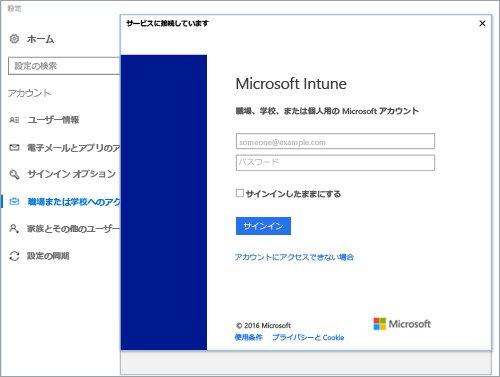

# Intune に Windows 10 デバイスを登録する

1.  **[職場または学校にアクセスする]** をタップし、**[接続]** をタップします。

    ![[職場または学校にアクセスする] のアカウントをタップする](./media/w10-enroll-rs1-connect-to-work-or-school.png)

2.  職場または学校の電子メール アドレスを入力し、**[次へ]** をタップします。

    

3. 職場または学校のアカウントで Intune にサインインします。

    

    会社または学校がデバイスを登録していることを示すメッセージが表示されます。

4. 「**準備が完了しました!**」という画面が表示されたら、 **[閉じる]** をタップします。 以上で完了です。

  !["準備が完了しました" 画面で、[閉じる] をタップします。 画面](./media/w10-enroll-rs1-youre-all-set.png)

5. 接続が適切なことを再確認する場合は、**[設定]** に戻ります。すると、職場または学校のアカウントが表示されます。

    

前の手順を実行しても職場または学校の電子メール アカウントとファイルにまだアクセスできない場合は、「[[職場または学校にアクセスする] が表示されている場合のトラブルシューティング手順](troubleshoot-your-windows-10-device-windows.md#troubleshooting-steps-to-follow-if-you-see-access-work-or-school)」に従ってください。

<!--HONumber=Dec16_HO2-->

