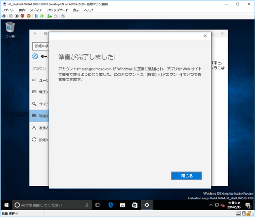

# Intune に Windows 10 Mobile または Windows 10 デスクトップ デバイスを登録する

職場または学校が Microsoft Intune を使用している場合は、お使いのデバイスを登録して、会社の電子メール、ファイル、またその他のリソースにアクセスできます。 デバイスを登録すると、組織は企業データをセキュリティで保護することができます。 登録の詳細については、「[ポータル サイト アプリをインストールし、Intune にデバイスを登録するとどうなるか](what-happens-if-you-install-the-company-portal-app-and-enroll-your-device-in-intune-windows.md)」と「[What your IT administrator can and can't see on your device](what-can-your-it-administrator-see-when-you-enroll-your-device-in-intune-windows.md)」 (IT 管理者がお客様のデバイスに関して確認できる情報と確認できない情報) を参照してください。

Windows 10 Mobile または Windows 10 デスクトップ デバイスを登録するには、次の手順を実行します。

1.  Windows の **[設定]** に移動し、**[アカウント]** をタップします。

    

2.  次の 2 つの画面を見て、お使いのデバイスの表示画面に似ている方をご確認ください。 デバイスの表示画面に対応する手順に従います。

    この画面が表示されている場合は、「[[Access work or school (職場または学校へのアクセス)] が表示されている場合の手順](#steps-to-follow-if-you-see-access-work-or-school)」に従います。

    

    この画面が表示されている場合は、「[[お使いのアカウント] が表示されている場合の手順](#steps-to-follow-if-you-see-your-account)」に従います。

    

## [Access work or school (職場または学校へのアクセス)] が表示されている場合の手順

1.  **[Access work or school (職場または学校へのアクセス)]** をタップします。

    

2.  職場または学校の電子メールを入力し、**[次へ]** をタップします。

    

3. 職場または学校のアカウントで Intune にサインインします。

    

    会社または学校がデバイスを登録していることを示すメッセージが表示されます。

4. 「**準備が完了しました!** 」というページが表示されたら、**[閉じる]** をタップします。 以上で完了です。

  

5. 接続が適切なことを再確認する場合は、**[設定]** に戻ります。すると、職場または学校のアカウントが表示されています。

    

上記の手順を実行しても職場または学校の電子メールとファイルにまだアクセスできない場合は、「[[Access work or school (職場または学校へのアクセス)] が表示されている場合のトラブルシューティング手順)](troubleshoot-your-windows-10-device-windows.md#troubleshooting-steps-to-follow-if-you-see-access-work-or-school)」に従ってください。

## [お使いのアカウント] が表示されている場合の手順

1.  Windows の **[設定]** に移動し、**[アカウント]** をタップします。

    

2.  **[お使いのアカウント]** をタップします。

    

3.  **[職場または学校アカウントを追加]** をタップします。

    

4.  職場または学校の資格情報でサインインします。

    

上記の手順を実行しても職場または学校の電子メールやファイルなどのデータにまだアクセスできない場合は、「[[お使いのアカウント] が表示されている場合のトラブルシューティング手順](troubleshoot-your-windows-10-device-windows.md#troubleshooting-steps-to-follow-if-you-see-your-account)」に従ってください。

さらに、ポータル サイト アプリをインストールすることもお勧めします。これにより、自分や自分の役割に関連する会社のアプリを簡単に識別して、取得できます。 会社での Intune の構成方法に応じて、ポータル サイト アプリが登録プロセスの一部としてインストールされていることもあります。 アプリがあるかどうかを確認するには、アプリ一覧で、**[ポータル サイト]** を検索します。 アプリの一覧で、[ポータル サイト] が表示されない場合は、次の手順に従ってインストールします。

1.  **[スタート]** &gt; **[ストア]** をタップします。

2.  **[検索]** をタップし、「**ポータル サイト**」と入力します。

3.  結果の一覧で、**[ポータル サイト]** &gt; **[インストール]** の順にタップします。

4.  **[インストール]** または **[無料]** をタップします。 表示されるオプションは、会社がどのようにアプリを構成したかによって異なります。

サポートが必要な場合は、 IT 管理者にお問い合わせください。 連絡先情報については、[ポータル サイト Web サイト](http://portal.manage.microsoft.com)をご確認ください。

### 関連項目
[Windows デバイスを Intune で使用する](using-your-windows-device-with-intune.md)

<!--HONumber=Aug16_HO3-->

