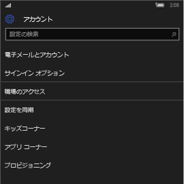
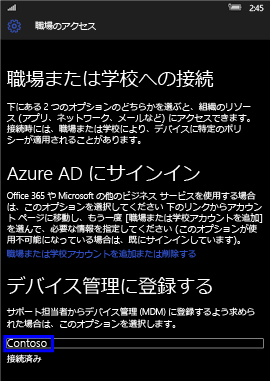
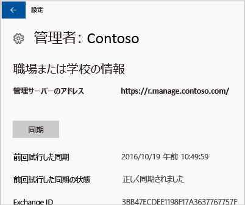

# Windows デバイスを手動で同期する
アプリのインストールに時間がかかりすぎる場合は、Windows デバイスを手動で同期してみてください。 手動で同期すると、インストールを高速化できることがあります。

次のバージョンのみがサポートされています。 デバイスがリストにない場合、同期はサポートされません。 お使いのデバイスの種類に対応した手順に従ってください。

* [Windows 10 Mobile](#windows-10-mobile)
* [Windows 10 デスクトップ](#windows-10-desktop)
* [Windows Phone 8.1](#windows-phone-81)

## [Windows] 10 Mobile
アプリのインストールを高速化するために Windows 10 Mobile デバイスを手動で同期するには:

1. **[すべてのアプリ]** > **[設定]** > **[アカウント]** の順にタップします。

    ![[設定] 画面の [アカウント] の選択](./media/win10m-sync-1-settings-accounts.png)

2. **[職場のアクセス]** を選択します。

    

3. **[デバイス管理に登録する]** で、会社名を選択します。

    

4. **[同期]** アイコンを選択します。

    ![[同期] アイコンの選択](./media/win10m-sync-4-tap-sync.png)

    画面の上部に、"アカウントを同期中" というメッセージが表示されます。 同期が完了するまで、**[同期]** ボタンは灰色表示になります。

## Windows 10 Desktop
Windows 10 には複数のバージョンがあるため、2 つの手順があります。 スクリーンショットを確認し、お使いのデバイスの表示画面に近い方の手順に従ってください。

1. **[スタート]** ボタンを選択し、**[設定]** を選択します。

    ![[スタート] ボタン](./media/win10pc-sync-1-start-button.png)

2. **[設定]** ページで、**[アカウント]** をクリックします。

    ![[設定] ページの [アカウント] の選択](./media/win10pc-sync-2-settings-accounts.png)

3. 次の 2 つの画面を見て、お使いのデバイスの表示画面に似ている方をご確認ください。 お使いのデバイスの表示画面に対応する手順に従います。

    [職場または学校にアクセスする] の画面が表示されている場合は、「[[職場または学校にアクセスする] が表示されている場合の手順](#steps-to-follow-if-you-see-access-work-or-school)」にある指示に従います。

    ![[職場または学校にアクセスする] が表示されている場合の同期手順](./media/w10-enroll-rs1-connect-to-work-or-school.png)

    [職場のアクセス] の画面が表示されている場合は、「[[職場のアクセス] が表示されている場合の手順](#steps-to-follow-if-you-see-your-account)」にある指示に従います。

    

### [職場または学校にアクセスする] が表示されている場合の手順

1. **[アカウント]** ページで、**[職場または学校にアクセスする]** を選択します。

    ![[職場または学校にアクセスする] を選択する](./media/w10-enroll-rs1-connect-to-work-or-school.png)

2. 職場または学校のアカウントを選択します。 IT 管理者が行った設定に応じて、以下に示す例のような 2 種類のアカウントが表示されます。 1 つのアカウントの横にはブリーフケースがあり、もう 1 つのアカウントの横には Microsoft のロゴがあります。

    - ブリーフケースが表示されているアカウントがある場合はそれを選択し、その下に **[情報]** ボタンが表示されていることを確認します。
    - Microsoft のロゴが表示されているアカウントしかない場合はそのアカウントを選択して、その下に **[情報]** ボタンが表示されていることを確認します。

    

3. **[情報]** ボタンを選択します。 次の例のようなダイアログ ボックスが開きます。

    

4. **[同期]** ボタンを選択します。 デバイスと Intune が同期されます。

### [職場のアクセス] が表示されている場合の手順

1. **[アカウント]** ページで、**[職場のアクセス]** を選択します。

    

2. **[Enroll in to device management]** (デバイス管理に登録する) セクションで、会社名を選択します。

    

3. **[同期]** ボタンを選択します。

    ![[同期] ボタンの選択](./media/win10pc-sync-5-tap-sync.png)

   同期が完了するまで、このボタンは灰色表示になります。

## Windows Phone 8。1
アプリのインストールを高速化するために Windows Phone 8.1 デバイスを手動で同期するには:

1. **[すべてのアプリ]** > **[設定]** > **[会社アカウント]** の順にタップします。

    

2. 会社名を選択します。

    

3. **[同期]** アイコンを選択します。

    ![[同期] アイコンの選択](./media/wp81-3-sync-tap-sync-button.png)

   デバイスで同期が完了するまでの間、画面の上部に、"アカウントを同期中" というメッセージが表示されます。

サポートが必要な場合は、 IT 管理者にお問い合わせください。 連絡先情報については、[ポータル サイト Web サイト](http://portal.manage.microsoft.com)をご確認ください。

<!--HONumber=Dec16_HO2-->

