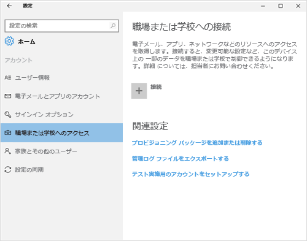

# Windows 10 デバイスの登録に関するトラブルシューティング
「[Intune に Windows 10 Mobile または Windows 10 デスクトップ デバイスを登録する](enroll-your-w10-phone-or-w10-pc-windows.md)」の手順を完了しても職場または学校の電子メールやファイルにアクセスできない場合は、次のトラブルシューティング手順を試してください。

1.  次の 2 つの画面を見て、お使いのデバイスの表示画面に似ている方をご確認ください。 お使いのデバイスの表示画面に対応する手順に従います。

    次の画面が表示されている場合は、「[[Access work or school (職場または学校へのアクセス)] が表示されている場合のトラブルシューティング手順](#troubleshooting-steps-to-follow-if-you-see-access-work-or-school)」の手順に従います。

    

    次の画面が表示されている場合は、「[[お使いのアカウント] が表示されている場合のトラブルシューティング手順](#troubleshooting-steps-to-follow-if-you-see-your-account)」の手順に従います。

    

## [Access work or school (職場または学校へのアクセス)] が表示されている場合のトラブルシューティング手順

1.  上記の手順を実行しても職場または学校の電子メールやファイルにアクセスできない場合は、**[Access work or school (職場または学校へのアクセス)]** に戻ります。

2. 以下のいずれかを実行します。

    - 次の画像のような接続が表示される場合は、その接続をタップして、[管理]、[情報]、[切断] の各オプションが表示されることを確認します。 これらのオプションが表示される場合は、登録および接続は完了しています。

    

    - 上に示した接続情報が表示されない場合、または接続情報は表示されるが一部のオプションが表示されない場合は、**[接続]** をタップし、職場または学校の資格情報でサインインします。 これで接続が完了します。

## [お使いのアカウント] が表示されている場合のトラブルシューティング手順

上記の手順を実行しても、職場または学校の電子メールやファイルなどのデータにアクセスできない場合は、**[アカウント]** に戻り、**[職場のアクセス]** をタップします。

- 職場または学校のアカウントが表示された場合は、正常に 接続されています。

- 職場または学校のアカウントが表示されない場合は、**[接続]** をタップしてから、職場または学校の資格情報でサインインします。

サポートが必要な場合は、 IT 管理者にお問い合わせください。 連絡先情報については、[ポータル サイト Web サイト](http://portal.manage.microsoft.com)をご確認ください。

<!--HONumber=Aug16_HO4-->

