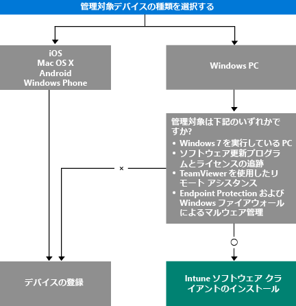

# デバイスを管理する方法を選択する

アプリのデプロイやデバイス設定の制御など、Intune が提供する多くの機能を活用するには、デバイスを*管理*する必要があります。 デバイスを管理する方法は、使用する Intune の機能によって異なります。
このトピックではニーズに応じた方法を選択できるようにします。

iOS、Mac OS X、Android、または Windows Phone を実行するデバイスを管理するために、デバイスを*登録*します。

Windows PC を管理するには、2 つの選択肢があります。

1. デバイスを登録する。**または、**
2. *Intune ソフトウェア クライアント*をインストールする。

## どの方法を使用するか判断する
このフローでどのようにデバイスを管理するかを決定します。

ほとんどの機能を利用するために Windows PC を登録します。 ただし、Intune ソフトウェア クライアントは、以下に該当する場合により適する可能性があります。

- PC が Windows 7 を実行している
- Windows ソフトウェア更新プログラムと使用ライセンスを管理する
- Endpoint Protection と Windows ファイアウォールでマルウェアを管理する
- TeamViewer ソフトウェアを使用してユーザーにリモート アシスタンスを提供する

それぞれの方法での管理機能の詳細については、[モバイル デバイス管理機能](mobile-device-management-capabilities-in-microsoft-intune.md)と[Intune PC ソフトウェア クライアント機能](windows-pc-management-capabilities-in-microsoft-intune.md)に関するページを参照してください。
Intune がサポートしているデバイスと PC については、「[サポートされるモバイル デバイスとコンピューター](/intune/get-started/supported-mobile-devices-and-computers)」を参照してください。

## Exchange ActiveSync による管理
デバイスの登録や Intune ソフトウェア クライアントのインストールの他に、[Exchange ActiveSync を使用](/intune/deploy-use/mobile-device-management-with-exchange-activesync-and-microsoft-intune)してデバイスを管理することもできます。 そのためには、On-Premises Connector をインストールするか、組み込みの Service to Service Connector を使用して Exchange Server に接続します。
この方法はデバイスを管理する 3 番目のオプションですが、他の方法と比較した場合、管理機能が限られます。

## 次のステップ

- [モバイル デバイスの登録方法の選択](/intune/get-started/choose-how-to-enroll-devices1)
- [Intune PC クライアント ソフトウェアを使用して Windows PC を管理する](/intune/deploy-use/manage-windows-pcs-with-microsoft-intune)

- [Microsoft Intune を使用した Exchange ActiveSync モバイル デバイスの管理](/intune/deploy-use/mobile-device-management-with-exchange-activesync-and-microsoft-intune)

<!--HONumber=Nov16_HO4-->

