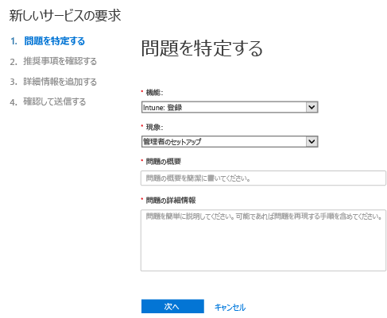
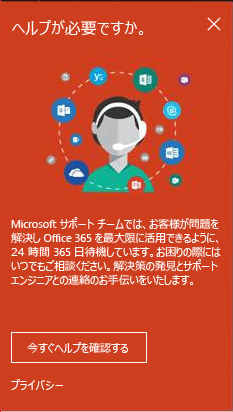
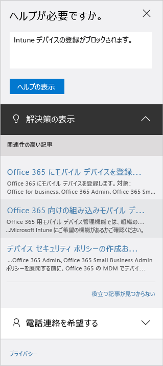

# 管理者が Microsoft Intune のサポートを受ける方法

[!INCLUDE[classic-portal](../includes/classic-portal.md)]

Microsoft サポートは、Microsoft Intune に世界的な技術、購入前、請求、およびサブスクリプションのサポートを提供しています。 有料サブスクリプションとトライアル サブスクリプションについて、オンラインと電話によるサポートを利用できます。 オンライン テクニカル サポートは、英語と日本語で提供されています。 電話によるサポートとオンライン課金サポートは、他の言語でも利用できます。

Intune のサポートについては、Configuration Manager で使用する場合、無料です。 Premier サポートを契約されているお客様は、手順に関する質問 (たとえば、Intune 機能を構成する方法) の場合、料金が発生します。

## サポート チケットを開かずにヘルプを見つける

サポート チケットを作成する前に、次のリソースで回答や情報を確認してください。 また、[Microsoft Intune の一般的なトラブルシューティングのヒント](https://docs.microsoft.com/intune/troubleshoot/general-troubleshooting-tips-for-microsoft-intune)も確認してください。

### Microsoft Intune TechNet フォーラム

Microsoft の技術スタッフに質問をお送りいただくか、ディスカッションにご参加ください。 回答や情報は、[Microsoft Intune TechNet フォーラム](https://social.technet.microsoft.com/Forums/home)で検索できます。

### Microsoft Intune UserVoice 製品フィードバック サイト

Microsoft による Intune の改善に役立つフィードバックはありますか。 Microsoft Intune の [UserVoice](https://microsoftintune.uservoice.com/forums/291681-ideas) フィードバック サイトにアイデアを追加してください。 他のユーザーが UserVoice に追加したアイデアに投票することもできます。 

## オンライン サポート チケットの作成

セルフヘルプ リソースに回答が見つからない場合は、オンライン サポート チケットを作成できます。

より良いサービスを提供するため、**各サポート チケットに含める問題は&1; つに制限してください**。 その理由を次に示します。

- 支援を提供するサポート エンジニアは、特定の分野を専門としている場合が多く、問題の解決に適した分野の専門家を見つける方がより簡単に解決します。
- エンジニアリング チームは多くのインシデントが発生している製品領域の作業を優先することができます。
- 難しい問題は適切なリソースにエスカレーションする方がより簡単に解決できます。

サポート チケットを作成する前に、[サポート インシデントの定義](#definition-of-a-support-incident)を確認してください。

**オンライン サポート チケットを作成するには**:

1.  Intune 資格情報を使用して [Office 365 管理センター](https://portal.office.com)にサインインします。
    >[!NOTE]
    >
    >Premier サポートを契約されているお客様は [Premier サポート ページ](https://support.microsoft.com/en-us/premier/contacts)で Intune サポート チケットを開くことができます。

2.  **[管理者]** タイルを選択します。
3.  左側の **[サポート]** で、**[サポート]** を選んでチケットを開きます。

    

    >[!NOTE]
    >  100 以下のライセンスの O365 アカウントを持つお客様には、このメッセージが表示されます。 表示される場合は、「[別の方法でサポート チケットを作成する](#create-a-support-ticket-with-alternate-methods)」を参照してください。

    > 

    -   請求、ライセンス、アカウントの問題については、**[請求と製品に関する情報]** を選択します。

    -   その他の Intune に関する問題については、**[モバイル デバイス管理]** を選択します。

    > [!NOTE]
    > すべてのカテゴリを表示するには、一覧の一番下にある **[詳細]** を選択します。

3.  手順に従ってリクエストを開きます。

### 別の方法でサポート チケットを作成する

サポート ページが次のように表示される場合は、以下の手順に従います。

1. [**Need help**] (ヘルプが必要) を選択します。
2. テキスト ボックスに問題に関する説明を入力して、**[ヘルプの表示]** を選択します。

    

3. 推奨オンライン リソースを確認するか、**[Let us call you]** (Microsoft からの電話サポート) を選択して、Microsoft サポートから電話を受けます。

## 電話サポートを受ける
国および地域別のサポート電話番号、サポート時間、各地域でのサポート言語の一覧については、「[Microsoft Intune のサポートの電話番号](contact-assisted-phone-support-for-microsoft-intune.md)」を参照してください。

## サポート リクエストの追跡
1.  Intune 資格情報を使用して [Office 365 管理センター](https://portal.office.com)にサインインします。
2.  **[管理者]** タイルを選択します。
3.  左側の **[サポート]** で **[サービス要求]** を選択します。 要求を確認できます。

要求に対する初回の応答は、問題の重大度によって異なります。 重大度が最も高い問題の場合、Professional サポートをご利用のお客様に対する初回の応答は、2 時間以内に行われます。 Premier サポートをご契約のお客様の場合、応答はサポート契約の内容によって変わります。 次のような事例が該当します。

- 1 つまたは複数のサービスにアクセスできないか使用不能です。
- 運用、操作、または展開の期日が重大な影響を受けているか、運用または収益性に重大な影響が出ると予想されます。
- 複数のユーザーまたはサービスが影響を受けています。

重大度が中程度の場合、Professional サポートをご利用のお客様に対しては、初回の応答が&4; 時間以内に行われます。 Premier サポートをご契約のお客様の場合、応答はサポート契約の内容によって変わります。  次のような事例が該当します。

- サービスは使用できますが、通常の機能とは異なります。
- ビジネスに中程度の影響があり、営業時間中に処理できます。
- 1 人のユーザー、顧客、またはサービスが部分的に影響を受けています。

その他の問題の場合、Professional サポートをご利用のお客様に対する初回の応答は、8 時間以内に行われます。 Premier サポートをご契約のお客様の場合、応答はサポート契約の内容によって変わります。  次のような事例が該当します。

- ビジネスへの影響は最小限です。
- 問題は重要ですが、顧客向けの現在のサービスや生産性に大きな影響はありません。
- 1 人のユーザーに部分的な中断が発生していますが、許容できる回避策があります。

> [!NOTE]
> **Microsoft System Center Configuration Manager** または **Microsoft System Center Endpoint Protection** を使用している場合: Configuration Manager または Endpoint Protection のテクニカル サポートについては、パートナーに問い合わせるか、[Microsoft System Center Configuration Manager/System Center Endpoint Protection Solution Center](http://www.microsoft.com/en-us/server-cloud/products/system-center-2012-r2/resources.aspx) にアクセスしてください。 オンラインまたは電話でサポート リクエストを開始することもできます。
>
> System Center Configuration Manager または System Center Endpoint Protection のテクニカル サポートは有料です。または既存のライセンスまたは Premire サポート契約の利用分としてカウントされます。

## ボリューム ライセンスのサポートを探す
ボリューム ライセンス プログラムで Microsoft からライセンスを購入済みの場合、サポートの問い合わせ先は次のとおりです。

-   ライセンスとキーの確認に関連するサポートの場合は、[ボリューム ライセンス サービス センター](http://go.microsoft.com/fwlink/p/?LinkID=282016)を参照してください。

-   請求に関する質問については、[請求とサブスクリプションの管理のサポート](http://support.microsoft.com/oas/default.aspx?prid=15371)を参照してください。

-   ボリューム ライセンスの一般的な情報については、[ボリューム ライセンス](http://go.microsoft.com/fwlink/p/?LinkID=282015)を参照してください。

## サポート インシデントの定義

サポート インシデントでは、1 つのサポートが必要な問題と、それを解決するために必要な作業が定義されています。 1 つのサポートの問題はさらに下位の問題に分けることはできません。 下位の問題が特定できる場合、その下位の問題は、それぞれ個別のインシデントと見なされます。 問題によっては、解決のために複数の連絡先やオフラインでの調査が必要になる場合があります。 こうしたソリューションを提供するために費やされた時間は、料金に含まれません。

"障害対応" のサポートは Microsoft Intune および Office 365 のモバイル デバイス管理のサブスクリプションに含まれているため、追加のサポート インシデントを作成しても、追加料金は発生しません。

サポート エンジニアから追加の問題についてサポート インシデントを作成するように求められた場合は、それがすべてのユーザーにとって役立つ情報であるということをご理解ください。 世界規模のサポートの提供について、ご理解とご協力をいただきありがとうございます。

インシデントごとの料金および深刻度については、「[プロフェッショナル サポート オプション](https://support.microsoft.com/gp/offerprophone)」を参照してください。

<!--HONumber=Jan17_HO4-->

