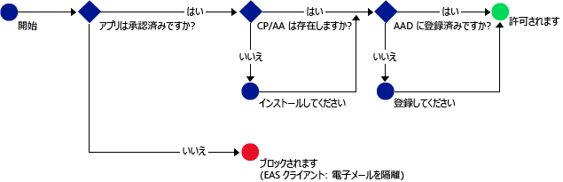

# Intune MAM ポリシーをサポートするモバイル アプリケーションのみが Office 365 サービスにアクセスできるようにする
[Intune モバイル アプリ管理 (MAM) ポリシー](protect-apps-and-data-with-microsoft-intune.md)を使用すると、Intune の管理対象に登録されているデバイス上の会社のデータを保護できます。 **Intune の監視対象に登録されていない従業員が所有するデバイス**に対して、MAM ポリシーを使用することもできます。  この場合、デバイスを管理しなくても、会社のデータとリソースが保護されていることを確認する必要があります。 MAM の条件付きアクセス (MAM CA) を使用すると、Exchange Online などの Office 365 サービスへのアクセスを、Intune MAM ポリシーをサポートするモバイル アプリのみに許可するポリシーを作成できます。

たとえば、Exchange Online へのアクセスを **Microsoft Outlook アプリ**のみに許可すると、**Exchange Online** からから電子メールを取得するように Intune MAM ポリシーのデータ保護を受けていない **iOS と Android の組み込み電子メール アプリをブロックできます**。

次の図は、MAM CA がアクセスを許可するかブロックするかを決定するために使用するフローです。。

図に使用されている省略語の説明は次のとおりです。
* **CP**: ポータル サイト アプリ
* **AA**: Azure Authenticator アプリ
* **AAD**: Azure Active Directory
* **EAS**: Exchange Active Sync

## 必要条件
MAM CA ポリシーを構成する**前に**、**Enterprise Mobility + Security または Azure Active Directory Premium サブスクリプション**を用意する必要があります。また、ユーザーに EMS または Azure AD のライセンスが付与される必要があります。 詳細については、「[Enterprise Mobility pricing page](https://www.microsoft.com/en-us/cloud-platform/enterprise-mobility-pricing)」 (Enterprise Mobility の価格) ページまたは「[Azure Active Directory の価格](https://azure.microsoft.com/en-us/pricing/details/active-directory/)」ページを参照してください。

## サポートされているアプリ
**Exchange Online**: Android および iOS 用 **Microsoft Outlook**。

MAM CA ポリシーがあるアプリのユーザー エクスペリエンスの詳細については、「[What to expect when using an app with MAM CA](use-apps-with-mam-ca.md)」(アプリと MAM CA を使用する場合の結果) を参照してください。

## 次のステップ
[MAM アプリ用の Exchange Online ポリシーを作成する](mam-ca-for-exchange-online.md)

[最新の認証を使用していないアプリをブロックする](block-apps-with-no-modern-authentication.md)

### 関連項目

[MAM ポリシーでアプリ データを保護する](protect-app-data-using-mobile-app-management-policies-with-microsoft-intune.md)

<!--HONumber=Oct16_HO4-->

