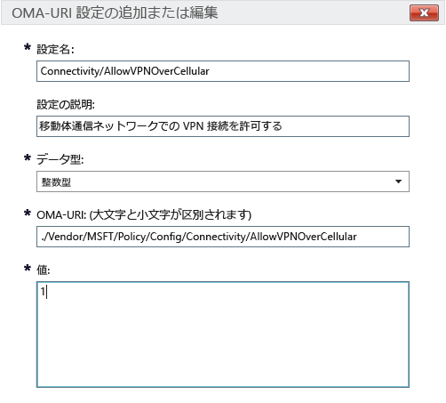

# Microsoft Intune での Windows 10 デバイス向けの Intune ポリシー設定

[!INCLUDE[classic-portal](../includes/classic-portal.md)]

このトピックには、Windows 10 デバイスの管理に使用できる Intune ポリシー設定を理解するのに役立つ情報が含まれています。 「[Microsoft Intune ポリシーを使用してデバイスの設定と機能を管理する](manage-settings-and-features-on-your-devices-with-microsoft-intune-policies.md)」にある手順とともにこのトピックを参照して、登録済みの Windows 10 デスクトップ、および Windows 10 Mobile デバイスの組み込みおよびカスタムの設定を構成してください。 これらのポリシーは、[Intune PC クライアント ソフトウェア](/intune/get-started/windows-pc-management-capabilities-in-microsoft-intune)を実行する PC では使用できません。

次の 2 種類のポリシーから選択できます。

- **カスタム ポリシー**: Windows 10 および Windows 10 Mobile 用の Microsoft Intune **カスタム ポリシー**を使用して、デバイスで各機能の制御に使用できる OMA-URI (Open Mobile Alliance Uniform Resource Identifier) 設定を展開します。 Windows 10 では、[Policy Configuration Service プロバイダー (Policy CSP)](https://technet.microsoft.com/itpro/windows/manage/how-it-pros-can-use-configuration-service-providers) を通して多くの設定を使用できます。
- **全般構成ポリシー**: Microsoft Intune で提供される組み込みの一覧から設定を選択する場合は、このポリシーを使用します。

## カスタム ポリシー設定

カスタム ポリシーで次の設定をします。

### 全般

名前を入力し、Intune コンソールで識別しやすくなるように、必要に応じてこのポリシーの説明も入力します。

### OMA-URI 設定

各 OMA-URI 設定を追加するには、次の情報を入力します。 このトピックにある [Windows 10 URI 設定のリファレンス](/intune/deploy-use/windows-10-policy-settings-in-microsoft-intune#Windows-10-URI-settings)で、使用できる設定の詳細について説明します。

- **設定名**: OMA-URI 設定の一意の名前を入力すると、設定リスト内で容易に識別できます。
- **設定の説明**: 必要に応じて、設定の説明を入力します。
- **データ型**: 次のデータ型から選択します。
    - **文字列**
    - **文字列型 (XML)**
    - **日付と時刻**
    - **整数型**
    - **浮動小数点**
    - **ブール型**
- **OMA-URI (大文字と小文字を区別)**: 設定対象の OMA-URI を指定します。
- **値**: 入力した OMA-URI に関連付ける値を指定します。

### 例
以下のスクリーン ショットで、**Connectivity/AllowVPNOverCellular** 設定が有効になりました。 これにより、移動体通信ネットワーク上の Windows 10 デバイスで OpenVPN 接続を利用できます。

> 

## - Windows 10 URI 設定
このセクションでは、**Windows 10 カスタム ポリシー**で構成できる OMA-URI 設定の詳細を説明します。

### ポリシー

|ポリシー名と URI|説明|
|---------------|------------|-----------|
|**自動更新を許可する** ./Vendor/MSFT/Policy/Config/Update/AllowAutoUpdate|デスクトップのみ **データ型:** 整数 **値:** **0** - **5** (既定: **1**)|
|**インストール日のスケジュール設定** ./Vendor/MSFT/Policy/Config/Update/ScheduledInstallDay|モバイルのみ **データ型:** 整数 **値:** **0** : 毎日 (既定値) **1**: 日曜日 **2**: 月曜日 **3**: 火曜日 **4**: 水曜日 **5**: 木曜日 **6**: 金曜日 **7**: 土曜日|
|**インストール時刻のスケジュール設定** ./Vendor/MSFT/Policy/Config/Update/ScheduledInstallTime|デスクトップおよびモバイル **データ型:** 整数 **値:**  **0** ～ **23** 時間 (**0** は午前 0 時) (既定: **3**)|
|**DeviceLock/AllowIdleReturnWithoutPassword** ./Vendor/MSFT/Policy/Config/DeviceLock/AllowIdleReturnWithoutPassword|モバイルのみ **データ型:** 整数 **値:** **0**: ユーザーはパスワードの猶予期間タイマーを設定できず、値は "毎回" に設定されます。 **1**: ユーザーがパスワードの猶予期間タイマーを設定できます (既定)。|
|**WiFi/AllowWiFi** ./Vendor/MSFT/Policy/Config/WiFi/AllowWiFi|モバイルのみ **データ型:** 整数 **値:** **0**: **Wi-Fi 接続の使用**を許可しません。 **1**: **Wi-Fi 接続の使用を許可** します (既定)。|
|**WiFi/AllowInternetSharing** ./Vendor/MSFT/Policy/Config/WiFi/AllowInternetSharing|デスクトップおよびモバイル **データ型:** 整数 **値: ** **0**: インターネット共有を許可しません   **1**: インターネット共有を許可します (既定)|
|**WiFi/AllowAutoConnectToWiFiSenseHotspots** ./Vendor/MSFT/Policy/Config/WiFi/AllowAutoConnectToWiFiSenseHotspots|デスクトップおよびモバイル **データ型:** 整数 **値: ** **0**: 許可しません。  **1**: 許可します (既定)|
|**WiFi/AllowManualWiFiConfiguration** ./Vendor/MSFT/Policy/Config/WiFi/AllowManualWiFiConfiguration|モバイルのみ **データ型:** 整数 **値:** **0**: MDM で構成した Wi-Fi 接続のみを許可します。 **1**: MDM によって既に作成された SSID だけでなく新しいネットワーク SSID の追加も許可します (既定値)|
|**System/AllowLocation** ./Vendor/MSFT/Policy/Config/System/AllowLocation|デスクトップおよびモバイル **データ型:** 整数 **値: ** **0**: 許可しません。  **1**: 許可します (既定)|
|**System/AllowTelemetry** ./Vendor/MSFT/Policy/Config/System/AllowTelemetry|デスクトップおよびモバイル **データ型:** 整数 **値:** **0** : 許可しません (Enterprise のみの設定) **1** : 制限あり **2**: すべて (既定) **3**: すべてと診断情報|
|**System/AllowExperimentation** ./Vendor/MSFT/Policy/Config/System/AllowExperimentation|デスクトップおよびモバイル **データ型:** 整数 **値:** **0** : 許可しません。 **1**: 設定のみ (既定) **2**: 設定と実験|
|**Security/AntiTheftMode** ./Vendor/MSFT/Policy/Config/Security/AntiTheftMode|モバイルのみ **データ型:** 整数 **値:** **0**: 盗難防止モードを許可しません。 **1**: ユーザーの設定 (既定)|
|**Connectivity/AllowUSBConnection** ./Vendor/MSFT/Policy/Config/Connectivity/AllowUSBConnection|モバイルのみ **データ型:** 整数 **値: ** **0**: 許可しません。  **1**: 許可します (既定)|
|**System/AllowUserToResetPhone** ./Vendor/MSFT/Policy/Config/System/AllowUserToResetPhone|モバイルのみ **データ型:** 整数 **値: ** **0**: 許可しません。 **1**: 許可します (既定)|
|**Connectivity/AllowCellularDataRoaming** ./Vendor/MSFT/Policy/Config/Connectivity/AllowCellularDataRoaming|デスクトップおよびモバイル **データ型:** 整数 **値: ** **0**: 許可しません。  **1**: 許可します (既定)|
|**Connectivity/AllowVPNOverCellular** ./Vendor/MSFT/Policy/Config/Connectivity/AllowVPNOverCellular|デスクトップおよびモバイル **データ型:** 整数 **値:** **0**: VPN で携帯電話による接続を許可しません。 **1**: VPN で携帯電話を含む任意の接続を使用できます (既定)。|
|**Connectivity/AllowVPNRoamingOverCellular** ./Vendor/MSFT/Policy/Config/Connectivity/AllowVPNRoamingOverCellular|モバイルのみ **データ型:** 整数 **値: ** **0**: 許可しません。  **1**: 許可します (既定)|
|**Connectivity/AllowVPNRoamingOverCellular** ./Vendor/MSFT/Policy/Config/Connectivity/AllowVPNRoamingOverCellular|モバイルのみ **データ型:** 整数 **値: ** **0**: 許可しません。  **1**: 許可します (既定)|
|**Connectivity/AllowBluetooth** ./Vendor/MSFT/Policy/Config/Connectivity/AllowBluetooth|デスクトップおよびモバイル **データ型:** 整数 **値:** **0**: ユーザーが Bluetooth を有効にすることを許可しません。 **1**: 予約済み。 ユーザーが Bluetooth を有効にして構成することができます (Windows Phone 8.1 (MDM または EAS 対応)、Windows 10 デスクトップ、Windows 10 Mobile ではサポートされていません)。 **2**: 許可済み。 ユーザーが Bluetooth を有効にして構成することができます (既定)。|
|**Experience/AllowScreenCapture** ./Vendor/MSFT/Policy/Config/Experience/AllowScreenCapture|モバイルのみ **データ型:** 整数 **値: ** **0**: 許可しません。  **1**: 許可します (既定)|
|**Experience/AllowTaskSwitcher** ./Vendor/MSFT/Policy/Config/Experience/AllowTaskSwitcher|モバイルのみ **データ型:** 整数 **値: ** **0**: 許可しません。  **1**: 許可します (既定)|
|**Experience/AllowVoiceRecording** ./Vendor/MSFT/Policy/Config/Experience/AllowVoiceRecording|モバイルのみ **データ型:** 整数 **値: ** **0**: 許可しません。  **1**: 許可します (既定)|
|**Experience/AllowSyncMySettings** ./Vendor/MSFT/Policy/Config/Experience/AllowSyncMySettings|モバイルのみ **データ型:** 整数 **値: ** **0**: ローミングを許可しません。  **1**: ローミングを許可します (既定)。|
|**Experience/AllowManualMDMUnenrollment** ./Vendor/MSFT/Policy/Config/Experience/AllowManualMDMUnenrollment|デスクトップおよびモバイル **データ型:** 整数 **値: ** **0**: 許可しません。  **1**: 許可します (既定)|
|**Accounts/AllowMicrosoftAccountConnection** ./Vendor/MSFT/Policy/Config/Accounts/AllowMicrosoftAccountConnection|デスクトップおよびモバイル **データ型:** 整数 **値:**  **0** : 許可しません。  **1**: 許可します (既定)|
|**Accounts/AllowAddingNonMicrosoftAccountsManually** ./Vendor/MSFT/Policy/Config/Accounts/AllowAddingNonMicrosoftAccountsManually|デスクトップおよびモバイル **データ型:** 整数 **値:**  **0** : 許可しません。  **1**: 許可します (既定)|
|**Security/AllowManualRootCertificateInstallation** ./Vendor/MSFT/Policy/Config/Security/AllowManualRootCertificateInstallation|モバイルのみ **データ型:** 整数 **値: ** **0**: 許可しません。  **1**: 許可します (既定)|
|**Security/AllowAddProvisioningPackages** ./Vendor/MSFT/Policy/Config/Security/AllowAddProvisioningPackages|デスクトップおよびモバイル **データ型:** 整数 **値: ** **0**: 許可しません。  **1**: 許可します (既定)|
|**Search/DisableBackoff** ./Vendor/MSFT/Policy/Config/Search/DisableBackoff|デスクトップおよびモバイル **データ型:** 整数 **値:**  **0** (既定)  **1**|
|**Search/PreventRemoteQueries** ./Vendor/MSFT/Policy/Config/Search/PreventRemoteQueries|デスクトップおよびモバイル **データ型:** 整数 **値:**  **0**  **1** (既定)|
|**Search/AllowUsingDiacritics** ./Vendor/MSFT/Policy/Config/Search/AllowUsingDiacritics|デスクトップおよびモバイル **データ型:** 整数 **値:**  **0** (既定)  **1**|
|**Search/AlwaysUseAutoLangDetection** ./Vendor/MSFT/Policy/Config/Search/AlwaysUseAutoLangDetection|デスクトップおよびモバイル **データ型:** 整数 **値:**  **0** (既定)  **1**|
|**Search/DisableRemovableDriveIndexing** ./Vendor/MSFT/Policy/Config/Search/DisableRemovableDriveIndexing|デスクトップおよびモバイル **データ型:** 整数 **値: ** **0** (既定)  **1**|
|**Search/PreventIndexingLowDiskSpaceMB** ./Vendor/MSFT/Policy/Config/Search/PreventIndexingLowDiskSpaceMB|デスクトップおよびモバイル **データ型:** 整数 **値:**  **0**  **1** (既定)|
|**Search/AllowIndexingEncryptedStoresOrItems** ./Vendor/MSFT/Policy/Config/Search/AllowIndexingEncryptedStoresOrItems|デスクトップおよびモバイル **データ型:** 整数 **値:**  **0** (既定)  **1**|
|**Security/AllowRemoveProvisioningPackage** ./Vendor/MSFT/Policy/Config/Security/AllowRemoveProvisioningPackage|デスクトップおよびモバイル **データ型:** 整数 **値: ** **0**: 許可しません。  **1**: 許可します (既定)|
|**Security/RequireProvisioningPackageSignature** ./Vendor/MSFT/Policy/Config/Security/RequireProvisioningPackageSignature|デスクトップおよびモバイル **データ型:** 整数 **値: ** **0** (既定)  **1**|
|**AboveLock/AllowActionCenterNotifications** ./Vendor/MSFT/Policy/Config/AboveLock/AllowActionCenterNotifications|デスクトップおよびモバイル **データ型:** 整数 **値: ** **0**: 許可しません。  **1**: 許可します (既定)|
|**TextInput/AllowIMENetworkAccess** ./Vendor/MSFT/Policy/Config/TextInput/AllowIMENetworkAccess|デスクトップのみ **データ型:** 整数 **値:** **0**: 許可しません。 オープン拡張辞書がオフになります。 ユーザーは次の操作を実行できません。 - 新しいオープン拡張辞書を追加する - 新しい検索統合構成ファイルを追加する - クラウドの候補機能を使用する - ユーザーが登録した単語を送信する **1**: 許可します。 オープン拡張辞書を追加して、既定で使用できます。 既定で検索統合機能も使用できます。 ユーザーは次の操作を実行できます。 - クラウドの候補機能を使用する|
|**TextInput/AllowIMELogging** ./Vendor/MSFT/Policy/Config/TextInput/AllowIMELogging|デスクトップのみ **データ型:** 整数 **値:** **0**: 誤変換記録機能が無効になります。 **1**: 誤変換記録機能が有効になります (既定)。|
|**TextInput/AllowJapaneseNonPublishingStandardGlyph** ./Vendor/MSFT/Policy/Config/TextInput/AllowJapaneseNonPublishingStandardGlyph|デスクトップのみ **データ型:** 整数 **値: ** **0**: 許可しません。  **1**: 許可します (既定)|
|**TextInput/AllowJapaneseIVSCharacters** ./Vendor/MSFT/Policy/Config/TextInput/AllowJapaneseIVSCharacters|デスクトップのみ **データ型:** 整数 **値: ** **0**: 許可しません。  **1**: 許可します (既定)|
|**TextInput/AllowJapaneseUserDictionary** ./Vendor/MSFT/Policy/Config/TextInput/AllowJapaneseUserDictionary|デスクトップのみ **データ型:** 整数 **値: ** **0**: 許可しません。  **1**: 許可します (既定)|
|**TextInput/AllowJapaneseIMESurrogatePairCharacters** ./Vendor/MSFT/Policy/Config/TextInput/AllowJapaneseIMESurrogatePairCharacters|デスクトップのみ **データ型:** 整数 **値: ** **0**: 許可しません。  **1**: 許可します (既定)|
|**TextInput/ExcludeJapaneseIMEExceptShiftJIS** ./Vendor/MSFT/Policy/Config/TextInput/ExcludeJapaneseIMEExceptShiftJIS|デスクトップのみ **データ型:** 整数 **値:** **0**: 文字はフィルター処理されません (既定)。 **1**: Shift JIS の文字を除くすべての文字をフィルター処理します。|
|**TextInput/ExcludeJapaneseIMEExceptJIS0208** ./Vendor/MSFT/Policy/Config/TextInput/ExcludeJapaneseIMEExceptJIS0208|デスクトップのみ **データ型:** 整数 **値:** **0**: 文字はフィルター処理されません (既定)。 **1**: JIS0208 の文字を除くすべての文字をフィルター処理します。|
|**TextInput/ExcludeJapaneseIMEExceptJIS0208andEUDC** ./Vendor/MSFT/Policy/Config/TextInput/ExcludeJapaneseIMEExceptJIS0208andEUDC|デスクトップのみ **データ型:** 整数 **値:** **0**: 文字はフィルター処理されません (既定)。 **1**: JIS0208 の文字または外字の文字を除くすべての文字をフィルター処理します。|
|**TextInput/AllowInputPanel** ./Vendor/MSFT/Policy/Config/TextInput/AllowInputPanel|デスクトップのみ **データ型:** 整数 **値: ** **0**: 許可しません。  **1**: 許可します (既定)|
|**Bluetooth/AllowDiscoverableMode** ./Vendor/MSFT/Policy/Config/Bluetooth/AllowDiscoverableMode|デスクトップおよびモバイル **データ型:** 整数 **値: ** **0**: 許可しません。  **1**: 許可します (既定)|
|**Bluetooth/AllowAdvertising** ./Vendor/MSFT/Policy/Config/Bluetooth/AllowAdvertising|デスクトップおよびモバイル **データ型:** 整数 **値: ** **0**: 許可しません。  **1**: 許可します (既定)|
|**Settings/AllowDataSense** ./Vendor/MSFT/Policy/Config/Settings/AllowDataSense|デスクトップおよびモバイル **データ型:** 整数 **値: ** **0**: 許可しません。  **1**: 許可します (既定)|
|**Settings/AllowVPN** ./Vendor/MSFT/Policy/Config/Settings/AllowVPN|デスクトップおよびモバイル **データ型:** 整数 **値: ** **0**: 許可しません。  **1**: 許可します (既定)|
|**Settings/AllowWorkplace** ./Vendor/MSFT/Policy/Config/Settings/AllowWorkplace|デスクトップのみ **データ型:** 整数 **値: ** **0**: 許可しません。  **1**: 許可します (既定)|
|**Settings/AllowDateTime** ./Vendor/MSFT/Policy/Config/Settings/AllowDateTime|デスクトップおよびモバイル **データ型:** 整数 **値: ** **0**: 許可しません。  **1**: 許可します (既定)|
|**Settings/AllowLanguage** ./Vendor/MSFT/Policy/Config/Settings/AllowLanguage|デスクトップのみ **データ型:** 整数 **値: ** **0**: 許可しません。  **1**: 許可します (既定)|
|**Settings/AllowRegion** ./Vendor/MSFT/Policy/Config/Settings/AllowRegion|デスクトップのみ **データ型:** 整数 **値: ** **0**: 許可しません。  **1**: 許可します (既定)|
|**Settings/AllowSignInOptions** ./Vendor/MSFT/Policy/Config/Settings/AllowSignInOptions|デスクトップのみ **データ型:** 整数 **値: ** **0**: 許可しません。  **1**: 許可します (既定)|
|**Settings/AllowYourAccount** ./Vendor/MSFT/Policy/Config/Settings/AllowYourAccount|デスクトップおよびモバイル **データ型:** 整数 **値: ** **0**: 許可しません。  **1**: 許可します (既定)|
|**Settings/AllowPowerSleep** ./Vendor/MSFT/Policy/Config/Settings/AllowPowerSleep|デスクトップのみ **データ型:** 整数 **値: ** **0**: 許可しません。  **1**: 許可します (既定)|
|**Settings/AllowAutoPlay** ./Vendor/MSFT/Policy/Config/Settings/AllowAutoPlay|デスクトップのみ **データ型:** 整数 **値: ** **0**: 許可しません。  **1**: 許可します (既定)|
|**Experience/AllowCortana** ./Vendor/MSFT/Policy/Config/Experience/AllowCortana|デスクトップおよびモバイル **データ型:** 整数 **値: ** **0**: 許可しません。  **1**: 許可します (既定)|
|**Search/SafeSearchPermissions** ./Vendor/MSFT/Policy/Config/Search/SafeSearchPermissions|モバイルのみ **データ型:** 整数 **値:** **0** : 厳密。成人向けコンテンツに対して最高レベルのフィルター処理を実行します。 **1**: 中程度。成人向けコンテンツに対して中程度のフィルター処理を実行します (有効な検索結果はフィルター処理されません) (既定)。|
|**Experience/AllowCopyPaste** ./Vendor/MSFT/Policy/Config/Experience/AllowCopyPaste|デスクトップのみ **データ型:** 整数 **値: ** **0**: 許可しません。  **1**: 許可します (既定)|
|**Force Start Size** ./Vendor/MSFT/Policy/Config/Start/ForceStartSize|モバイルのみ **データ型:** 整数 **値:** **0**: ユーザーによるサイズ変更を許可します (既定)。 **1**: 非全画面表示を強制します。 **2**: 全画面表示を強制します。|
|**Update/RequireDeferUpgrade** ./Vendor/MSFT/Policy/Config/Update/RequireDeferUpgrade|デスクトップおよびモバイル **データ型:** 整数 **値:** **0**: アップグレードを遅延せず、CB (現在のブランチ) を維持します (既定)。 **1**: 更新とアップグレードの遅延を有効にします。デバイスは CBB (ビジネスの現在のブランチ) の規則に従います。 詳細については、以下を参照してください。 [Windows 10 サービスの概要](https://technet.microsoft.com/library/mt598226.aspx) [Windows 10 の展開計画](https://technet.microsoft.com/library/mt574241.aspx)|
|**Update/DeferUpdatePeriod** ./Vendor/MSFT/Policy/Config/Update/DeferUpdatePeriod|デスクトップおよびモバイル **説明:** ソフトウェアの更新を最大 4 週間遅延させるポリシー。 **データ型:** 整数 **値:**  **0**: 直ちに更新プログラムを適用します (既定)。 **1** - **4**: ソフトウェアの更新を遅延する期間 (週)。 詳細については、以下を参照してください。 [Windows 10 サービスの概要](https://technet.microsoft.com/library/mt598226.aspx) [Windows 10 の展開計画](https://technet.microsoft.com/library/mt574241.aspx)|
|**Update/DeferUpgradePeriod** ./Vendor/MSFT/Policy/Config/Update/DeferUpgradePeriod|デスクトップおよびモバイル **説明:** 機能のアップグレードを最大 8 か月間遅延させるポリシー。 **データ型:** 整数 **値:** **0**: 直ちに更新プログラムを適用します (既定)。 **1** - **8**: 機能のアップグレードを遅延する期間 (月)。 詳細については、以下を参照してください。 [Windows 10 サービスの概要](https://technet.microsoft.com/library/mt598226.aspx) [Windows 10 の展開計画](https://technet.microsoft.com/library/mt574241.aspx)|
|**Update/PauseDeferrals** ./Vendor/MSFT/Policy/Config/Update/PauseDeferrals|デスクトップおよびモバイル **説明:** デバイスが更新とアップグレードの受信を 5 週間停止できるようにします。 **データ型:** 整数 **値:** **0**: 直ちに更新プログラムを適用します (既定)。 **1**: 更新とアップグレードを一時停止します (一時停止の期限は 5 週間です)。|

### Windows Defender

|ポリシー名と URI|説明|
|---------------|-----------|
|**AllowRealtimeMonitoring** ./Vendor/MSFT/Policy/Config/Defender/AllowRealtimeMonitoring|デスクトップのみ **データ型:** 整数 **値: ** **0**: 許可しません。  **1**: 許可します (既定)|
|**AllowBehaviorMonitoring** ./Vendor/MSFT/Policy/Config/Defender/AllowBehaviorMonitoring|デスクトップのみ **データ型:** 整数 **値: ** **0**: 許可しません。  **1**: 許可します (既定)|
|**AllowIntrusionPreventionSystem** ./Vendor/MSFT/Policy/Config/Defender/AllowIntrusionPreventionSystem|デスクトップのみ **データ型:** 整数 **値: ** **0**: 許可しません。  **1**: 許可します (既定)|
|**AllowIOAVProtection** ./Vendor/MSFT/Policy/Config/Defender/AllowIOAVProtection|デスクトップのみ **データ型:** 整数 **値:**  **0** : 許可しません。  **1**: 許可します (既定)|
|**AllowScriptScanning** ./Vendor/MSFT/Policy/Config/Defender/AllowScriptScanning|デスクトップのみ **データ型:** 整数 **値: ** **0**: 許可しません。  **1**: 許可します (既定)|
|**AllowOnAccessProtection** ./Vendor/MSFT/Policy/Config/Defender/AllowOnAccessProtection|デスクトップのみ **データ型:** 整数 **値: ** **0**: 許可しません。  **1**: 許可します (既定)|
|**RealTimeScanDirection** ./Vendor/MSFT/Policy/Config/Defender/RealTimeScanDirection|デスクトップのみ **データ型:** 整数 **値:** **0**: 全ファイルの監視 (既定) **1** : 受信ファイルの監視 **2** : 送信ファイルの監視|
|**DaysToRetainCleanedMalware** ./Vendor/MSFT/Policy/Config/Defender/DaysToRetainCleanedMalware|デスクトップのみ **データ型:** 整数 **値:** **0**  -  **90**: マルウェアを保持する時間を表します。 **0**: マルウェアを永続的に検疫フォルダー内に保持します。自動的に削除しません (既定)。|
|**AllowUserUIAccess** ./Vendor/MSFT/Policy/Config/Defender/AllowUserUIAccess|デスクトップのみ **データ型:** 整数 **値: ** **0**: 許可しません。  **1**: 許可します (既定)|
|**ScanParameter** ./Vendor/MSFT/Policy/Config/Defender/ScanParameter|デスクトップのみ **データ型:** 整数 **値:** **1**: クイック スキャン (既定) **2**: フル スキャン|
|**ScheduleScanDay** ./Vendor/MSFT/Policy/Config/Defender/ScheduleScanDay|デスクトップのみ **データ型:** 整数 **値:** **0**: 毎日 (既定) **1**: 月曜日 **2**: 火曜日 **3**: 水曜日 **4**: 木曜日 **5**: 金曜日 **6**: 土曜日 **7**: 日曜日 **8** : スキャンはスケジュールされません|
|**ScheduleScanTime** ./Vendor/MSFT/Policy/Config/Defender/ScheduleScanTime|デスクトップのみ **データ型:** 整数 **値:** **0**: 午前 12:00 **60** : 午前 1:00 **120**: 午前 2:00 (既定) **180** : 午前 3:00 **240** : 午前 4:00 **300** : 午前 5:00 **360** : 午前 6:00 **420** : 午前 7:00 **480** : 午前 8:00 **540** : 午前 9:00 **600** : 午前 10:00 **660** : 午前 11:00 **720** : 午後 0:00 **780** : 午後 1:00 **840** : 午後 2:00 **900** : 午後 3:00 **960** : 午後 4:00 **1020** : 午後 5:00 **1080** : 午後 6:00 **1140** : 午後 7:00 **1200** : 午後 8:00 **1260** : 午後 9:00 **1320** : 午後 10:00 **1381** : メンテナンス期間|
|**ScheduleQuickScanTime** ./Vendor/MSFT/Policy/Config/Defender/ScheduleQuickScanTime|デスクトップのみ **データ型:** 整数 **値:** **0**: 午前 12:00 **60** : 午前 1:00 **120**: 午前 2:00 (既定) **180** : 午前 3:00 **240** : 午前 4:00 **300** : 午前 5:00 **360** : 午前 6:00 **420** : 午前 7:00 **480** : 午前 8:00 **540** : 午前 9:00 **600** : 午前 10:00 **660** : 午前 11:00 **720** : 午後 0:00 **780** : 午後 1:00 **840** : 午後 2:00 **900** : 午後 3:00 **960** : 午後 4:00 **1020** : 午後 5:00 **1080** : 午後 6:00 **1140** : 午後 7:00 **1200** : 午後 8:00 **1260** : 午後 9:00 **1320** : 午後 10:00 **1380** : 午後 11:00|
|**AVGCPULoadFactor** ./Vendor/MSFT/Policy/Config/Defender/AVGCPULoadFactor|デスクトップのみ **データ型:** 整数 **値: ** **0** - **100** (既定: **50**)|
|**AllowArchiveScanning** ./Vendor/MSFT/Policy/Config/Defender/AllowArchiveScanning|デスクトップのみ **データ型:** 整数 **値: ** **0**: 許可しません。  **1**: 許可します (既定)|
|**AllowEmailScanning** ./Vendor/MSFT/Policy/Config/Defender/AllowEmailScanning|デスクトップのみ **データ型:** 整数 **値: ** **0**: 許可しません (既定)  **1**: 許可します|
|**AllowFullScanRemovableDriveScanning** ./Vendor/MSFT/Policy/Config/Defender/AllowFullScanRemovableDriveScanning|デスクトップのみ **データ型:** 整数 **値: ** **0**: 許可しません (既定)  **1**: 許可します|
|**AllowFullScanOnMappedNetworkDrives** ./Vendor/MSFT/Policy/Config/Defender/AllowFullScanOnMappedNetworkDrives|デスクトップのみ **データ型:** 整数 **値: ** **0**: 許可しません。  **1**: 許可します (既定)|
|**AllowScanningNetworkFiles** ./Vendor/MSFT/Policy/Config/Defender/AllowScanningNetworkFiles|デスクトップのみ **データ型:** 整数 **値: ** **0**: 許可しません。  **1:**: 許可します (既定): "許可" に設定されている場合は、RTP がオンのときにも実行されます。|
|**SignatureUpdateInterval** ./Vendor/MSFT/Policy/Config/Defender/SignatureUpdateInterval|デスクトップのみ **データ型:** 整数 **値:** **0**: 定期的に署名を確認しません。 **1**: 1 時間ごとにシグネチャを確認します。 **2**: 2 時間ごとに確認します。  **24**: 毎日確認します。 **8**: 8 時間ごとに確認します (既定)。|
|**AllowCloudProtection** ./Vendor/MSFT/Policy/Config/Defender/AllowCloudProtection|デスクトップのみ **データ型:** 整数 **値: ** **0**: 許可しません。  **1**: 許可します (既定)|
|**SubmitSamplesConsent** ./Vendor/MSFT/Policy/Config/Defender/SubmitSamplesConsent|デスクトップのみ **データ型:** 整数 **値:** **0**: 常に確認のメッセージを表示します (既定)。 **1** : 安全なサンプルを自動的に送信します。 **2** : 送信することはありません。 **3** : すべてのサンプルを自動的に送信します。|
|**ExcludedExtensions** ./Vendor/MSFT/Policy/Config/Defender/ExcludedExtensions|デスクトップのみ **データ型:** 文字列 **値:** *&lt;セミコロンで区切られた拡張子の一覧&gt;*例: **obj; lib** **既定値:** 拡張子は除外されません。|
|**ExcludedPaths** ./Vendor/MSFT/Policy/Config/Defender/ExcludedPaths|デスクトップのみ **データ型:** 文字列 **値:** *&lt;セミコロンで区切られたパスの一覧&gt;* 例: **c:\test;c:\test1.exe** **既定値:** 除外されるパスはありません。|
|**ExcludedProcesses** ./Vendor/MSFT/Policy/Config/Defender/ExcludedProcesses|デスクトップのみ **データ型:** 文字列 **値:** *&lt;セミコロンで区切られたパスの一覧&gt;* 例: **c:\test.exe;c:\test1.exe** **既定値:** 除外されるプロセスはありません。|

### Edge ブラウザー

|ポリシー名と URI|説明|
|---------------|------------|-----------|
|**ブラウズを許可する** ./Vendor/MSFT/Policy/Config/Browser/AllowBrowser|モバイルのみ **データ型:** 整数 **値: ** **0**: 参照しません。  **1**: 参照します (既定)。|
|**AllowSearchSuggestionsinAddressBar** ./Vendor/MSFT/Policy/Config/Browser/AllowSearchSuggestionsinAddressBar|デスクトップおよびモバイル **データ型:** 整数 **値: ** **0**: 候補を表示しません。  **1**: 候補を表示します (既定)。|
|**SendIntranetTraffictoInternetExplorer** ./Vendor/MSFT/Policy/Config/Browser/SendIntranetTraffictoInternetExplorer|デスクトップのみ **データ型:** 整数 **値:** **0**: 無効 (Edge ブラウザーでイントラネット サイトを開きます) (既定)。 **1**: 有効 (Internet Explorer でイントラネット サイトを開きます)。|
|**追跡禁止を許可する** ./Vendor/MSFT/Policy/Config/Browser/AllowDoNotTrack|デスクトップおよびモバイル) **データ型:** 整数 **値: ** **0**: 無効 (DNT を送信しません) (既定)。  **1**: 有効 (DNT を送信します)。|
|**SmartScreen を構成する** ./Vendor/MSFT/Policy/Config/Browser/AllowSmartScreen|デスクトップおよびモバイル **データ型:** 整数 **値: ** **0**: 許可しません。  **1**: 許可します (既定)。|
|**ポップアップを許可する** ./Vendor/MSFT/Policy/Config/Browser/AllowPopups|デスクトップのみ **データ型:** 整数 **値: ** **0**: ポップアップ ウィンドウをブロックします (既定)。  **1**: ポップアップ ウィンドウを許可します。|
|**Cookie を使用する** ./Vendor/MSFT/Policy/Config/Browser/AllowCookies|デスクトップおよびモバイル **データ型:** 整数 **値:** **0**: すべての Web サイトの Cookie を許可します (既定)。 **1**: サード パーティの Cookie のみブロックします。 **2**: すべての Cookie をブロックします。|
|**パスワードの保存を許可する** ./Vendor/MSFT/Policy/Config/Browser/AllowPasswordManager|デスクトップおよびモバイル **データ型:** 整数 **値:** **0**: Password Manager を無効にします。  **1**: Password Manager を有効にします (既定)。|
|**オートコンプリートを使用する** ./Vendor/MSFT/Policy/Config/Browser/AllowAutofill|デスクトップのみ **データ型:** 整数 **値**:  **0**: 無効 (既定)。  **1**: 有効。|
|**エンタープライズ サイトのリストを構成する** ./Vendor/MSFT/Policy/Config/Browser/EnterpriseModeSiteList|デスクトップのみ **データ型:** 文字列 **値:** **0**: 構成されていません。 **1**: IE のエンタープライズ モード サイト リストが構成されている場合はそれを使用します (既定)。 **2**: エンタープライズ サイト リストの場所を指定します。|

## 全般構成ポリシーの設定

Windows 10 用の Microsoft Intune **全般構成ポリシー**を使用して、登録済みの Windows 10 デスクトップと Windows 10 Mobile デバイスの組み込み設定を構成します。

### パスワード

|設定の名前|追加情報 (必要な場合)|
|----------------|----------------------|
|**デバイスのロック解除にパスワードを必要とする**|-|
|**必要なパスワードの種類**|パスワードを英数字にするか数値のみにするかを指定します。|
|**必要なパスワードの種類** - **文字セットの最小数**| パスワードに含める必要がある文字セット (小文字、大文字、数字、記号) の数を指定します。|
|**最小のパスワードの長さ**|Windows 10 Mobile のみに適用|
|**デバイスをワイプするまでの連続サインイン エラーの数**。|Windows 10 を実行しているデバイス: デバイスの BitLocker が有効な場合は、指定した回数分サインインに失敗すると、BitLocker 回復モードになります。 デバイスの BitLocker が有効でない場合は、この設定は適用されません。 Windows 10 Mobile を実行しているデバイス: 指定した回数分サインインに失敗すると、デバイスがワイプされます。|
|**画面がオフになるまでの非アクティブな時間 (分)**|画面がロックされるデバイスがどれだけの時間アイドル状態であると、画面がロックされるかを指定します。|
|**パスワードの有効期限 (日)**|デバイスのパスワードを設定後、変更が必要になるまでの日数を指定します。|
|**パスワードの履歴を記憶する**|ユーザーに対して、以前に使用されたことのあるパスワードの作成を制限するかどうかを指定します。|
|**パスワードの履歴を保存する** - **前のパスワードを再利用できないようにする**|デバイスで記憶される、以前に使用したパスワードの数を指定します。|
|**デバイスがアイドル状態から戻るときにパスワードを必須とする**|ユーザーがデバイスのロックを解除するときにパスワードの入力を必須にします (Windows 10 Mobile のみ)。|

### 暗号化

|設定の名前|追加情報 (必要な場合)|
|----------------|----------------------|
|**モバイル デバイスの暗号化を要求する**|対象デバイスの暗号化を有効にします。 (Windows 10 Mobile のみ)|

### System (システム)

|設定の名前|追加情報 (必要な場合)|
|----------------|----------------------|
|**画面のキャプチャを許可する**|ユーザーがデバイスの画面を画像としてキャプチャできるようにします (Windows 10 Mobile のみ)。|
|**手動での登録解除を許可する**|ユーザーがデバイスから会社アカウントを手動で削除できるようにします|
|**ルート証明書の手動インストールを許可する**|Windows 10 Mobile に適用|
|**診断と利用状況データの Microsoft への送信を許可する**|次の値をとります。  **[いいえ]** - データは Microsoft に送信されません。 **[基本]** - 一部の情報のみを Microsoft に送信します。 **[拡張]** - より詳細な診断データを Microsoft に送信します。 **[完全 (推奨)]** - **[拡張]** で送信されるデータに加えて、デバイスの状態に関する追加データを送信します。|

### アカウントと同期

|設定の名前|追加情報 (必要な場合)|
|----------------|----------------------|---------------------|
|**Microsoft アカウントを許可する**|ユーザーがデバイスに Microsoft アカウントを関連付けられるようにします|
|**Microsoft 以外のアカウントの手動追加を許可する**|Microsoft アカウントに関連付けられていないデバイスに、ユーザーが電子メール アカウントを追加できるようにします|
|**Microsoft アカウントに対して設定同期を許可する**|Microsoft アカウントに関連付けられたデバイスとアプリの設定をデバイス間で同期できるようにします|

### Microsoft Edge

|設定の名前|追加情報 (必要な場合)|
|----------------|----------------------|
|**Web ブラウザーを許可する**|デバイスで Microsoft Edge Web ブラウザーを使用できるようにします。 (Windows 10 Mobile のみ)|
|**アドレス バーで検索候補を許可する**|検索語句を入力したときに、検索エンジンからサイトが提案されるようになります。|
|**Internet Explorer へのイントラネット トラフィックの送信を許可する**|ユーザーが Internet Explorer でイントラネット Web サイトを開けるようになります。 (Windows 10 デスクトップのみ)|
|**追跡禁止を許可する**|ユーザーがアクセスする Web サイトへトラッキング拒否ヘッダーを送信できるように、Edge ブラウザーを構成します。|
|**SmartScreen を有効にする**||
|**アクティブ スクリプティングを使用する**|JavaScript などのスクリプトが Edge ブラウザーで実行できるようにします。|
|**ポップアップを許可する**|Windows 10 デスクトップのみに適用|
|**Cookie を使用する**||
|**オートコンプリートを使用する**|ユーザーがブラウザーのオートコンプリートの設定を変更できるようにします。 (Windows 10 デスクトップのみ)|
|**Password Manager を許可する**|Microsoft Edge Password Manager 機能を有効または無効にします。|
|**エンタープライズ モード サイト リストの場所**|エンタープライズ モードで開く Web サイトの一覧を検索できる場所を指定します。 ユーザーは、この一覧を編集できません。 (Windows 10 デスクトップのみ)|

### アプリ

|設定の名前|追加情報 (必要な場合)|
|----------------|----------------------|---------------------|
|**アプリケーション ストアを許可する**|Windows 10 Mobile のみに適用|

### 移動体通信

|設定の名前|追加情報 (必要な場合)|
|----------------|----------------------|---------------------|
|**データ ローミングを許可する**|データへのアクセス中にネットワーク間のローミングを許可します。|
|**移動体通信で VPN を許可する**|移動体通信ネットワークに接続したときに、デバイスが VPN 接続にアクセスできるようにするかどうかを制御します。|
|**移動体通信で VPN ローミングを許可する**|移動体通信ネットワークでのローミング中に、デバイスが VPN 接続にアクセスできるようにするかどうかを制御します。|

### ハードウェア

|設定の名前|追加情報 (必要な場合)|
|----------------|----------------------|
|**カメラを許可する**|-|
|**リムーバブル記憶域を許可する**|SD カードなどの外部記憶装置をデバイスで使用できるようにするかどうかを指定します。|
|**Wi-Fi を許可する**|Windows 10 Mobile のみに適用|
|**インターネット共有を許可する**|デバイスでインターネット接続の共有を使用できるようにします。|
|**Wi-Fi の手動設定を許可する**|ユーザーが独自に Wi-Fi 接続を構成できるようにするか、Wi-Fi プロファイルで構成された接続のみを使用できるようにするかを制御します。 (Windows 10 Mobile のみ)|
|**無料 Wi-Fi スポットへの自動接続を許可する**|デバイスが無料の Wi-Fi ホットスポットに自動的に接続し、接続の使用条件に自動的に同意するようにします。|
|**位置情報を許可する**|デバイスが位置情報サービスの情報を使用できるかどうかを指定します。|
|**NFC を許可する**|デバイスが近距離無線通信機能を使用できるようにします。|
|**Bluetooth を許可する**|-|
|**Bluetooth 検出可能モードを許可する**|その他の Bluetooth 対応デバイスにより、デバイスが検出されるようにします|
|**Bluetooth 広告を許可する**|デバイスが Bluetooth 経由で公開通知を受信できるようにします|
|**電話リセットを許可する**|ユーザーがデバイスを工場出荷時設定にリセットできるかどうかを制御します。|
|**USB 接続を許可する**|デバイスが USB 接続を介して外部記憶域装置にアクセスできるかどうかを制御します|
|**盗難防止モードを許可する**|Windows の盗難防止モードを有効にするかどうかを構成します|

### 機能

|設定の名前|追加情報 (必要な場合)|
|----------------|----------------------|---------------------|
|**コピーと貼り付けを許可する**|Windows 10 Mobile のみに適用|
|**音声録音を許可する**|Windows 10 Mobile のみに適用|
|**Cortana を許可する**|Cortana による音声アシスタントを有効または無効にします|
|**アクション センターの通知を許可する**|デバイス ロック画面上でのアクション センターの通知を有効または無効にします (Windows 10 Mobile のみ)|

### Windows Defender

すべての設定は Windows 10 デスクトップのみに適用されます。

|設定の名前|追加情報 (必要な場合)|
|----------------|----------------------|---------------------|
|**リアルタイム監視を許可する**|マルウェアやスパイウェアなど、望ましくないソフトウェアについてのリアルタイム スキャンを有効にします。|
|**動作監視を許可する**|デバイス上で特定の既知のパターンで行われる疑わしい動作を、Defender がチェックできるようにします。|
|**ネットワーク検査システムを有効にする**|ネットワーク検査システム (NIS) は、ネットワークを利用した悪用からデバイスを保護するのに役立ちます。NIS は、Microsoft Endpoint Protection Center で把握している脆弱性のシグネチャを使用して、悪意のあるトラフィックを検出し、ブロックします。|
|**すべてのダウンロードをスキャンする**|Defender がインターネットからダウンロードされたすべてのファイルをスキャンするかどうかを制御します。|
|**スクリプトのスキャンを許可する**|Defender が Internet Explorer で使用されているスクリプトをスキャンできるようにします。|
|**ファイルとプログラムのアクティビティを監視する**|デバイス上のファイルとプログラムのアクティビティの監視を Defender に許可します。|
|**解決済みマルウェアを追跡する日数**|指定した日数の間、Defender で解決済みマルウェアの追跡を続けられるようにし、以前に影響を受けたデバイスを手動でチェックできるようにします。 日数を **0** に設定すると、マルウェアは検疫フォルダーに残り、自動的に削除されなくなります。 |
|**クライアント UI アクセスを許可する**|Windows Defender ユーザー インターフェイスをユーザーに対して非表示にするかどうかを制御します。 この設定の変更は、ユーザーの PC が次に再起動されたときに有効になります。|
|**毎日のクイック スキャンのスケジュール**|毎日のクイック スキャンが選択した時間に実行されるように、スケジュール設定できるようにします。|
|**システム スキャンを予定に入れる**|システムのフル スキャンまたはクイック スキャンが選択した日時に定期的に実行されるように、スケジュール設定できるようにします。|
|**スキャン中の CPU 使用率の制限**|スキャンに使用できる CPU の使用率を制限できるようにします (**1** から **100** まで)。|
|**アーカイブ ファイルをスキャンする**|Zip ファイルや Cab ファイルなどのアーカイブ済みのファイルを Defender がスキャンできるようにします。|
|**電子メール メッセージをスキャンする**|デバイスに届いた電子メール メッセージを Defender が直ちにスキャンできるようにします。|
|**リムーバブル ドライブをスキャンする**|USB スティックなどのリムーバブル ドライブを Defender がスキャンできるようにします。|
|**マップされたネットワーク ドライブをスキャンする**|マップ済みネットワーク ドライブ上のファイルを Defender がスキャンできるようにします。 ドライブ上のファイルが読み取り専用である場合、Defender は検出したマルウェアを一切削除できません。|
|**ネットワークの共有フォルダーから開いたファイルをスキャンする**|共有ネットワーク ドライブ上のファイルを Defender がスキャンできるようにします (UNC パスからアクセスされたファイルなど)。 ドライブ上のファイルが読み取り専用である場合、Defender は検出したマルウェアを一切削除できません。|
|**署名更新間隔**|Defender が新しいシグネチャ ファイルをチェックする間隔を指定します。|
|**クラウド保護を許可する**|管理対象のデバイスからマルウェアのアクティビティに関する情報が Microsoft Active Protection Service に送信されるのを許可またはブロックします。 この情報は、将来的に本サービスの品質向上を目的として使用されます。|
|**ユーザーにサンプルの提出を指示する**|悪意の有無を判断するために、Microsoft による詳しい分析が必要な可能性のあるファイルを、Microsoft に自動的に送信するかどうかを制御します。|
|**望ましくない可能性があるアプリケーションの検出**|Windows Defender によって望ましくない可能性があると判断されたソフトウェアの実行から、登録済みの Windows デスクトップ デバイスを保護します。 このようなアプリケーションの実行からコンピューターを保護したり、望ましくない可能性があるアプリケーションがいつインストールされたのかを監査モードでレポートしたりできます。|
|**スキャンまたはリアルタイム保護から除外するファイルとフォルダー**|**C:\Path** や **%ProgramFiles%\Path\filename.exe** などのファイルやフォルダーを、除外リストに 1 つ以上追加します。 これらのファイルとフォルダーは、リアルタイムまたはスケジュールされたスキャンの対象外となります。|
|**スキャンの実行中、またはリアルタイム保護の使用時に除外するファイル拡張子**|**jpg** や **txt** などのファイル拡張子を、除外リストに 1 つ以上追加します。 これらの拡張子が付いたファイルは、リアルタイムまたはスケジュールされたスキャンの対象外となります。|
|**スキャンの実行中、またはリアルタイム保護の使用時に除外するプロセス**|**.exe**、**.com**、**.scr** などの種類のプロセスを、除外リストに 1 つ以上追加します。 これらのプロセスは、リアルタイムまたはスケジュールされたスキャンの対象外となります。|

### Updates

|設定の名前|追加情報 (必要な場合)|
|----------------|---------------|
|**自動更新を直ちにインストールすることを許可する**|自動更新を直ちにインストールすることを許可します。 以下のいずれかの設定を構成して、更新動作を制御します。 **ダウンロードを通知する** **メンテナンス時刻に自動的にインストールする** **メンテナンス時刻に自動的にインストールし、再起動する** **スケジュールした時刻に自動的にインストールして再起動する**: このオプションを選択した場合は、**[エンド ユーザーに通知を表示しない]** と **[スケジュールされた更新プログラムのインストール日を定義してください]** の設定も構成できます。 (Windows 10 デスクトップのみ)|
|**プレリリース機能を有効にする**|Microsoft が Windows 10 デバイスにプレリリース版の設定と機能を展開できるようにします。 設定のみを許可するか、またはプレリリース版のすべての設定と機能のインストールを許可するかを選択できます。|

### 関連項目
[Microsoft Intune ポリシーを使用してデバイスの設定と機能を管理する](manage-settings-and-features-on-your-devices-with-microsoft-intune-policies.md)

