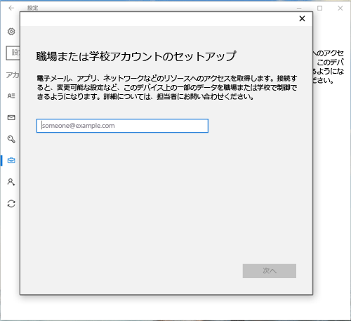
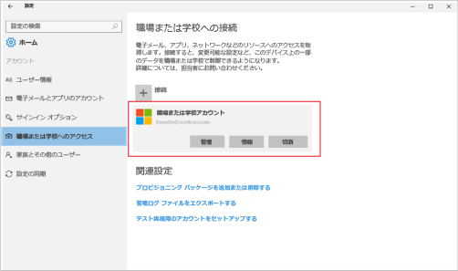

# Intune に Windows 10 デバイスを登録する

<iframe src="https://channel9.msdn.com/Series/IntuneEnrollment/Windows-Enrollment/player" width="960" height="540" allowFullScreen frameBorder="0"></iframe>

1.  **[スタート] メニュー**に移動し、**[設定]** ボタンを選択して、**[Windows の設定]** アプリを開きます。 検索バーで "設定" を検索することもできます。

2. **[アカウント]** > **[職場または学校にアクセスする]** > **[接続]** の順に選択します。

    ![[職場または学校にアクセスする] アカウントの選択](./media/w10-enroll-rs1-connect-to-work-or-school.png)

3.  職場または学校の電子メール アドレスを入力し、**[次へ]** を選択します。

    

4. 職場または学校のアカウントで Intune にサインインします。

    

    会社または学校がデバイスを登録していることを示すメッセージが表示されます。

5. 「**準備が完了しました!**」という画面が表示されたら、 **[閉じる]** を選択します。 以上で完了です。

  !["準備が完了しました" という画面で [閉じる] を 選択する](./media/w10-enroll-rs1-youre-all-set.png)

6. 接続が適切なことを再確認する場合は、**[設定]** に戻ります。すると、職場または学校のアカウントが表示されます。

    

前の手順を実行しても職場または学校の電子メール アカウントとファイルにまだアクセスできない場合は、「[[職場または学校にアクセスする] が表示されている場合のトラブルシューティング手順](troubleshoot-your-windows-10-device-windows.md#troubleshooting-steps-to-follow-if-you-see-access-work-or-school)」に従ってください。

