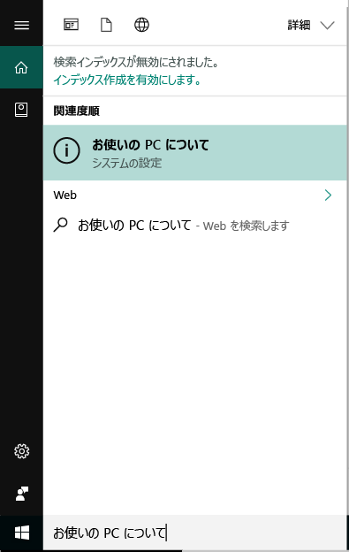
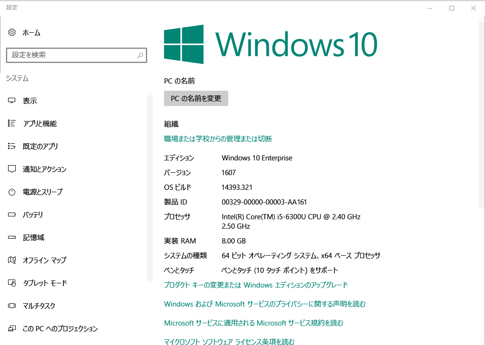

# Intune ポータル サイトで Windows デバイスの登録  

職場と学校のアプリ、電子メールやファイルをセキュリティで保護されたアクセスするために Intune ポータル サイト アプリに Windows デバイスを登録します。 場合は、組織が必要ですか、特定のアプリをお勧め、Office、OneDrive などを受信するかに、登録時にか、登録後にポータル サイトで使用できる、あるします。  

ポータル サイト web サイトを通じて Windows 10 デバイスを登録できます*または*アプリ。 Windows の以前のバージョンを使用したデバイスを登録する場合は、ポータル サイト web サイトを通じてデバイスを登録する必要があります。  

## インストールの会社ポータル アプリケーション  
既に、ポータル サイト アプリをデバイスにインストールされているがあります。 アプリの確認、__すべてのアプリ__一覧。  アプリの一覧で、[ポータル サイト] が表示されない場合は、次の手順に従ってインストールします。  

1. 開いている**Microsoft Store**デバイス。

2. **検索**フィールドに「**ポータル**します。

3. 結果のリストで、**[ポータル サイト]** > **[インストール]** の順に選択します。

4. **[インストール]** または **[無料]** を選択します。 これら 2 つのオプションです。 違いはありません。アプリを構成、組織の設定に基づいて、単語が表示されます。  

## Windows 10 のバージョン番号を検索します。  
異なるバージョンの Windows 10 デバイスの登録手順が異なります。 次の手順は、Windows 10 のバージョン番号を検索する方法をについて説明するデスクトップおよびモバイル デバイス。 お使いのバージョンを確認した後は、推奨される登録の手順に進みます。  

### Windows 10 Desktop デバイス  

1. **[スタート]** メニューに移動します。

2. 検索バーで、PC です"情報"という語句を入力します 選択__PC 情報__結果から。  

     

3. 下へスクロールして**Windows 仕様**を検索する、**バージョン**Windows 10 PC にインストールされているのです。  

     

4. お使いのバージョンがある場合  

    *  __1607 以降__: でのデバイスを登録、 [**設定** > **アカウント** > **アクセス職場または学校**ルート](enroll-windows-10-device.md#enroll-windows-10-version-1607-and-later-device)します。   
    * __1511 以前__: でのデバイスを登録、 [**設定** > **アカウント** > **アカウント**ルート](enroll-windows-10-device.md#enroll-windows-10-version-1511-and-earlier-device)します。  

### Windows 10 Mobile デバイス       

1.  移動して__すべてのアプリ__を選択し、__設定__アプリ。  
2.  __[システム]__ > __[バージョン情報]__ を選択します。      
3.  __デバイス情報__、検索、__バージョン__します。  
4. お使いのバージョンがある場合  

    *  __1607 以降__: を使用して、デバイスを登録、 [**設定** > **アクセス職場または学校**ルート](enroll-windows-10-device.md#enroll-windows-10-version-1607-and-later-device)します。   
    * __1511 以前__: を使用して、デバイスを登録、 [**設定** > **アカウント**ルート](enroll-windows-10-device.md#enroll-windows-10-version-1511-and-earlier-device)します。  

## 非 Windows 10 デバイスを登録します。  
ポータル サイト web サイトでサポートされているその他の Windows デバイスを登録するのにには、次の記事を使用します。   
* [Windows 8.1 または Windows RT 8.1 デバイス](enroll-your-W81-or-rt81-windows.md)  
* [Windows Phone 8.1 デバイス](enroll-your-wp81-windows.md)    

## 次の手順  
サポートされているデバイス、および Windows 10、バージョン番号がわかったらは、推奨される登録の記事に進んでください。  
 
デバイス管理の詳細については、ポータル、および学校および職場でのどちらを使用両方方法には、次の記事がご覧ください。  
* [管理対象デバイスを使用して職場または学校のリソースにアクセスする](use-managed-devices-to-get-work-done.md)  
* [ポータル サイト アプリをインストールし、Intune に iOS または Mac OS X デバイスを登録するとどうなりますか](what-happens-if-you-install-the-company-portal-app-and-enroll-your-device-in-intune-windows.md)  
* [デバイスを登録した場合に組織が確認できる情報](what-info-can-your-company-see-when-you-enroll-your-device-in-intune.md)  

サポートが必要な場合は、 社内サポートに問い合わせてください。 [ポータル サイト web サイトに移動して](https://go.microsoft.com/fwlink/?linkid=2010980)を見つける、組織の IT 連絡先情報。  
